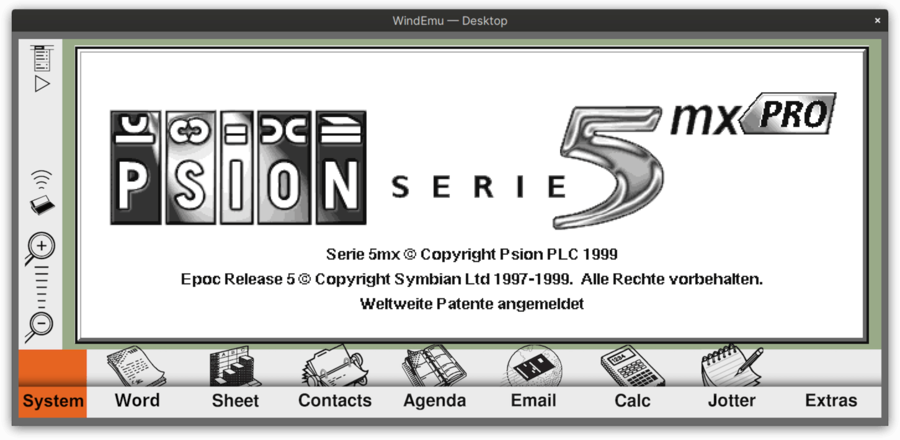

# WindEmu user front-end for desktop linux

A alphaish frontend for WindEmu based on WindRm code.



You will need a ROM. I tested a Psion 5mx rom on the screenshot.

To run:
```
$ ./WindEmu [name of ROM file e.g. Sys$rom.bin] 
```

First start takes some time, stay tuned :)
Full state will be written to a 32MB `psion.out` file in the same directory on quit. On future launches, `WindEmu` will look for the `psion.out` file and restore that state.

Sometimes the `psion.out` gets corrupted! Don't use this Emulator in a productive environment!